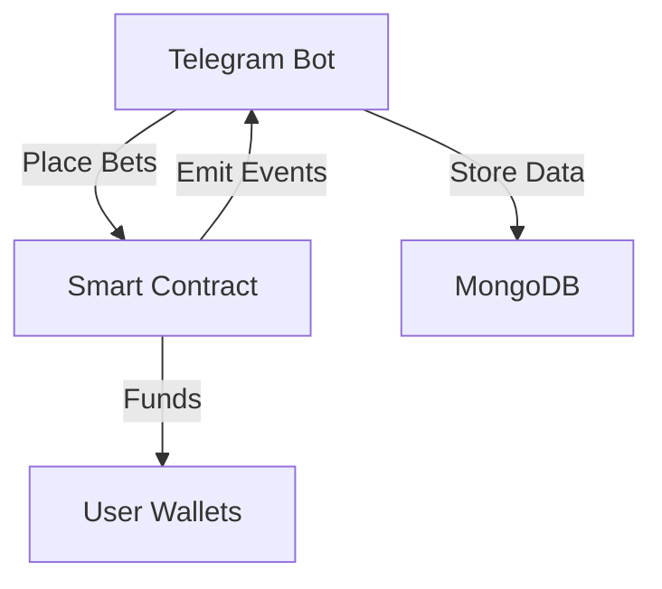

# 🎰 Solana Telegram Betting Bot

Project for My first Solana Project by Superteam Balkan.
A decentralized betting platform on Telegram powered by Solana smart contracts.

## 🌟 Features

- 💸 On-chain betting with SOL tokens
- 📊 Price prediction markets (Long/Short)
- 🔒 Non-custodial wallet integration
- ⚡ Instant payouts via smart contract
- 📈 Real-time game analytics

## 📦 Prerequisites

- Node.js v16+
- Telegram Bot Token
- Solana CLI (for contract deployment)
- MongoDB database
- anchor

## 🚀 Quick Start

### 1. Clone Repository

```bash
git clone https://github.com/LibbryCY/solbet_telegraf_bot.git
cd solana-betting-bot
```

### 2. Install Dependencies

```bash
npm install
```

### 3. Configure Environment

Create `.env` file:

```env
BOT_TOKEN=telegram_bot_token
MONGO_URI=mongodb://localhost:27017/betting-bot
CONTRACT_ADDRESS=YourContractAddressHere
RPC_ENDPOINT=https://api.devnet.solana.com
```

## ⚙️ System Architecture



## 📜 Smart Contract Methods

```javascript
// Core Contract Functions
contract.create_game(tokenAddress, duration);
contract.place_bet(gameId, amount, prediction);
contract.calculate_winner(gameId);
```

## 🤖 Bot Commands

| Command                               | Description         |
| ------------------------------------- | ------------------- |
| `/connect`                            | Link your wallet    |
| `/balance`                            | Check SOL balance   |
| `/wallet`                             | View your wallet    |
| `/betstart`                           | Start betting game  |
| `/bet <gameId> <amount> <long/short>` | Place prediction    |
| `/help`                               | Help message        |
| `/status`                             | Active games status |
| `/menu`                               | Options menu        |

## 🔧 Deployment

### 1. Deploy Contract

```bash
anchor deploy
```

### 2. Start Bot

```bash
npm start
# Or for production:
pm2 start bot.js --name solana-betting-bot
```

## 📊 Transaction Flow

1. User sends `/bet` command
2. Bot creates an on-chain transaction
3. Smart contract validates and records the bet
4. Oracle updates price data
5. Contract settles and distributes prizes

## Check the video to see the bot in practice:

Link: `https://www.loom.com/share/308eac896f2847fa9368f9d1454ce1bf?sid=b1c6ed1d-6d69-4160-ae26-1f34935708d1`

## 📄 License

MIT

## 📧 Contact

Dev support - hugemerlin91@gmail.com
